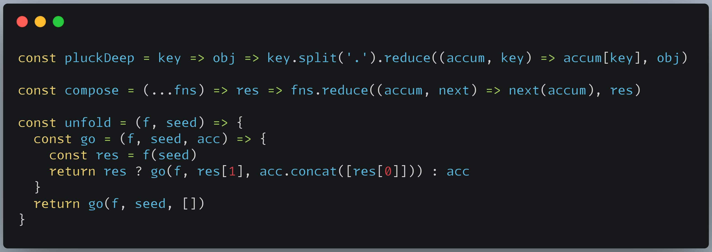
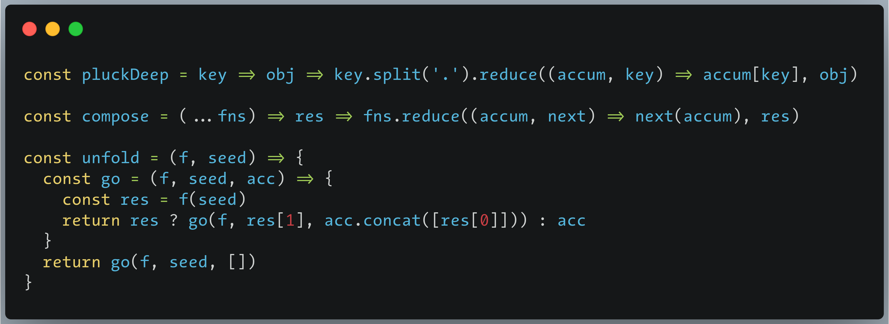

Best fonts for programming

## Fonts
1. Aurulent: it looks like written by Lamy-pen, add missing glyphs from fira code;
2. Consolas: hinted,a better version for Windows 7;
3. Droid Sans Mono: Android official monospace font, it is most legible font for reading IMO, so use it for long reading;
4. Fira Code: v5.2, regular as bold;
5. JuliaMono: a font for math programming, it contains 8000+ glyphs, many math sign symbols;
6. Menlo: it's TheSans, beautiful font for both screen and print;
7. SF Mono: the new macOS default monospace font after Monaco and Menlo;
7. Source Code Pro: medium as regular, the medium looks like written by art fountain pen, the official default hint is really beautiful on Windows 7;

Tips: only use the unhinted font when your monitor screen has high ppi(2K/4K monitor).

## Screenshots
Aurulent

Menlo

!!! The copyright of all these fonts belongs to their authors!
